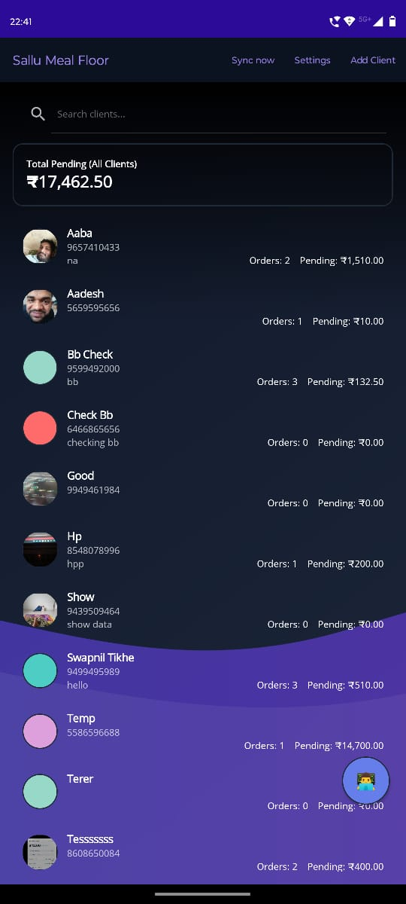
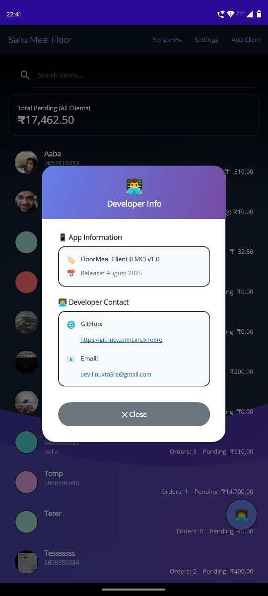
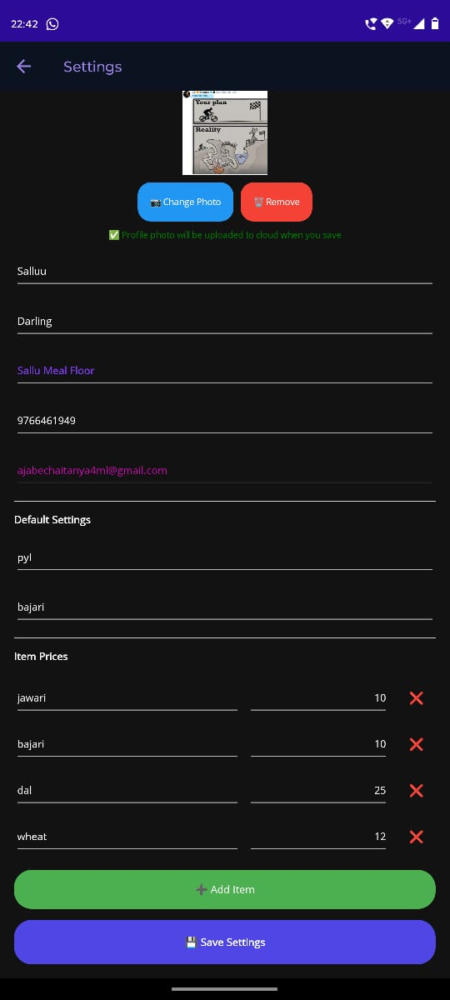
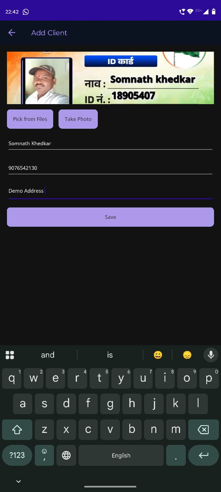
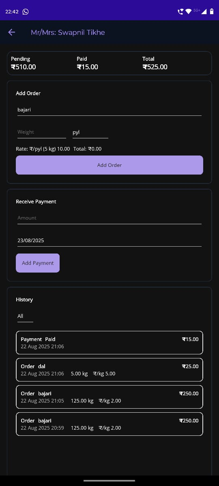

<h1 align="center">
  Floor Meal Client (FMC) - <i>For Friends Shop</i>
</h1>
A .NET MAUI Android app for managing a small floor-meal/mill ledger. Track clients, orders, payments, and pending amounts. Works offline with SQLite; optionally syncs with AWS DynamoDB. Login is via Gmail OTP. images can be uploaded to ImgBB.

<h2>Highlights:</h2>

- Android app (.NET MAUI, net9.0-android)
- Clients, orders (kg/gram/pyl), payments, pending totals
- Offline-first (sqlite-net-pcl) + optional AWS sync
- Gmail OTP login (@gmail.com only)
- Client/profile photos via camera or picker; optional ImgBB upload
- Background sync and durable outbox for reliable uploads

<h2>Platform and stack:</h2>

- Platform: Android
- Tech: .NET 9, .NET MAUI, CommunityToolkit.Maui, CommunityToolkit.Mvvm
- Storage: sqlite-net-pcl
- Cloud: AWS DynamoDB + Cognito Identity, Gmail SMTP, ImgBB API

<h2>Project layout (key files):</h2>

- FMC.sln                             Solution file
- FloorMealApp/                       MAUI project
  - App.xaml, AppShell.xaml           App + navigation
  - MainPage.xaml                     Dashboard (clients, totals)
  - AddClientPage.xaml                Add client, photo
  - ClientDetailPage.xaml             Orders, payments, history
  - PaymentsPage.xaml                 Payments list
  - SettingsPage.xaml                 Profile, defaults, prices
  - LoginPage.xaml                    Gmail OTP
  - Core.cs                           Models, DatabaseService, MainViewModel
  - Pages.cs                          ClientDetailViewModel, PaymentsViewModel
  - SettingsPage.cs                   SettingsData, SettingsViewModel
  - AwsSyncService.cs, SyncScheduler.cs
  - GmailSmtpEmailSender.cs, ImgBBService.cs, PermissionService.cs

<h2>Configuration (summary): </h2>

- AWS tables (Partition key MailId; string):
  - ClientLedger_Credentials
  - ClientLedger_AppSetting
  - ClientLedger_Client   (Sort key ClientId as String)
  - ClientLedger_Order    (Sort key OrderId as String)
  - ClientLedger_Payment  (Sort key PaymentId as String)
- Cognito Identity Pool with DynamoDB access to the tables above.
- GLOBAL credentials item (in ClientLedger_Credentials):
  - MailId = "GLOBAL"
  - SmtpUser = your Gmail address
  - SmtpAppPassword = Gmail App Password
  - ImgBBApiKey = optional (for image uploads)
- Optional packaged config: FloorMealApp/Resources/Raw/awsconfig.json
  {
    "EnableAwsSync": true,
    "AwsRegion": "ap-south-1",
    "CognitoIdentityPoolId": "ap-south-1:xxxxxxxx-xxxx-xxxx-xxxx-xxxxxxxxxxxx"
  }

<h2>Build and run: </h2>

- Prerequisites: .NET 9 SDK, Android SDK, MAUI Android workload
  - dotnet workload install maui-android
- Visual Studio: open FMC.sln, set FloorMealApp as startup, select an Android device, Run.
- CLI:
  - dotnet restore FMC.sln
  - dotnet build FloorMealApp -f net9.0-android
- Release APK:
  - dotnet publish FloorMealApp -f net9.0-android -c Release -o artifacts
  - Note: FloorMealApp.csproj has Release signing settings pointing to C:\keys\fmc.keystore. Update or remove before publishing.

<h2>Usage:</h2>

1) Launch: If no login, you’ll be routed to Login.
2) Login: Enter Gmail address, tap Send code, enter OTP.
3) Settings: Set Floor Meal name, default unit, and item prices.
4) Add client: Name/contact/notes; pick or capture a photo.
5) Add order: Choose item/unit, enter weight; rate auto-derives from Settings.
6) Receive payment: Enter amount/date; pending updates.
7) Sync: Toolbar “Sync now”; background sync runs periodically and on connectivity changes.

<h2>Permissions:</h2>

- Camera: capture client photos
- Media/Storage: pick images and save captured photos
- Internet: AWS/SMTP/ImgBB

<h2>Screenshots:</h2>

- Dashboard

  
- Developer Info
  
  
- User Settings
  
  
- Add Client
  
  
- Client Details
  
  
